# Homelab Service Gallery

This page showcases all the applications and services running in this homelab setup. Each service includes a screenshot and links to detailed configuration guides in their respective directories.

## Quick Navigation

- [📊 **Proxmox**](../proxmox/) - Virtualization platform and infrastructure setup
- [🏠 **Homepage**](../homepage/) - Service dashboard and monitoring
- [📁 **Samba**](../samba/) - Network file sharing and storage
- [☁️ **Cloud Services**](../cloud/) - Nextcloud and Immich for file storage and photo backup
- [🎬 **Media Stack**](../media/) - Complete entertainment and media management
- [🌐 **Networking**](../networking/) - DNS, proxy, and network infrastructure
- [📈 **Monitoring**](../monitoring/) - System monitoring and observability

---

## Service Overview

### Infrastructure & Management

#### Homepage Dashboard
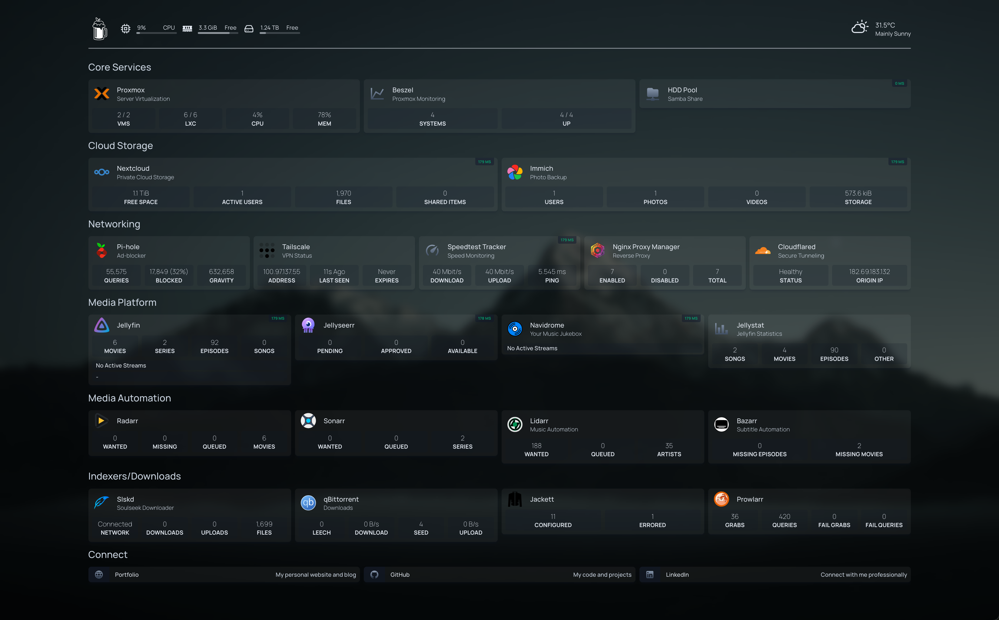

**Purpose:** Central dashboard for accessing all services  
**Details:** [Homepage Configuration](../homepage/)

---

### Storage & Files

#### Nextcloud
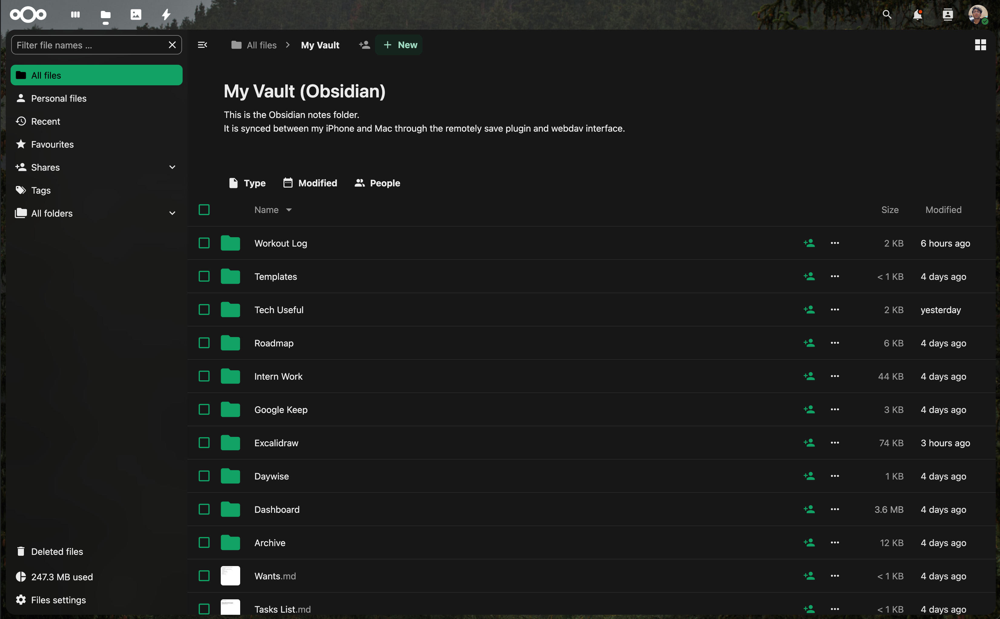

**Purpose:** Self-hosted cloud storage and collaboration  
**Details:** [Cloud Services Setup](../cloud/)

#### Immich
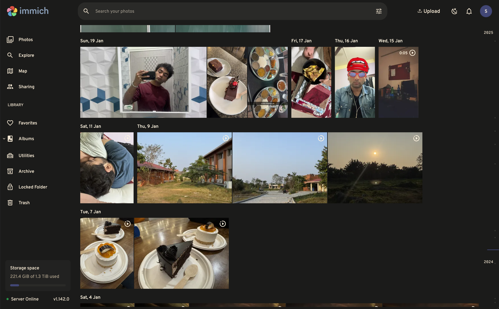

**Purpose:** Photo backup and management (Google Photos replacement)  
**Details:** [Cloud Services Setup](../cloud/)

#### Samba File Server
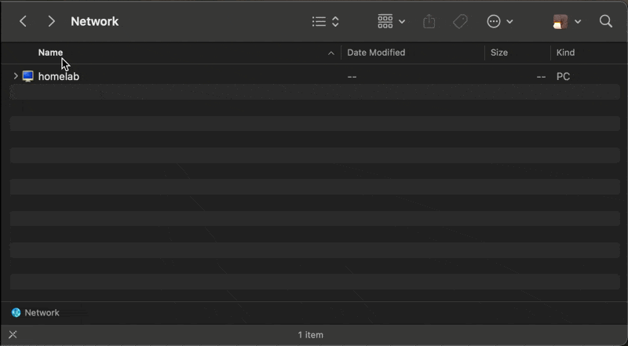

**Purpose:** Network file sharing and centralized storage  
**Details:** [Samba Configuration](../samba/)

---

### Media & Entertainment

#### Jellyfin
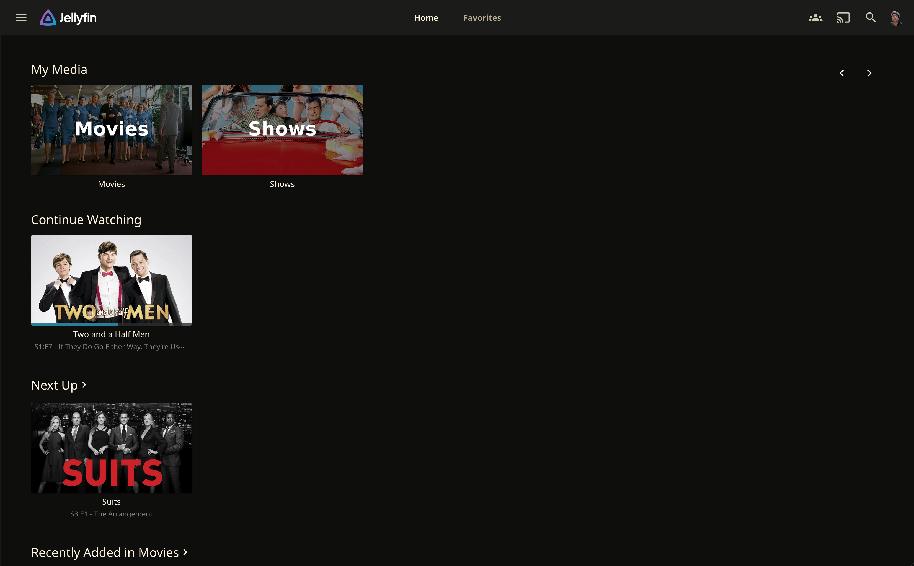

**Purpose:** Open-source media streaming server  
**Details:** [Media Stack Setup](../media/)

#### Jellyseerr

**Purpose:** Media request and discovery platform  
**Details:** [Media Stack Setup](../media/)

#### Radarr
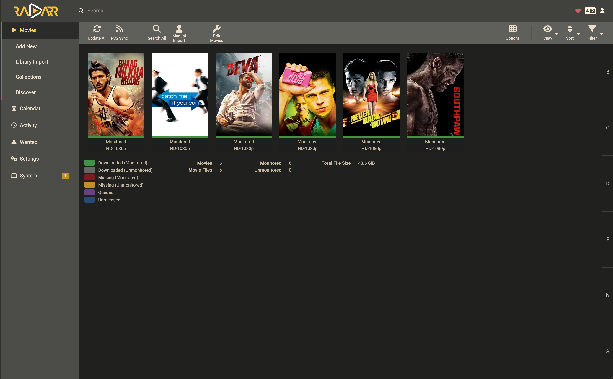

**Purpose:** Movie collection management  
**Details:** [Media Stack Setup](../media/)

#### Sonarr
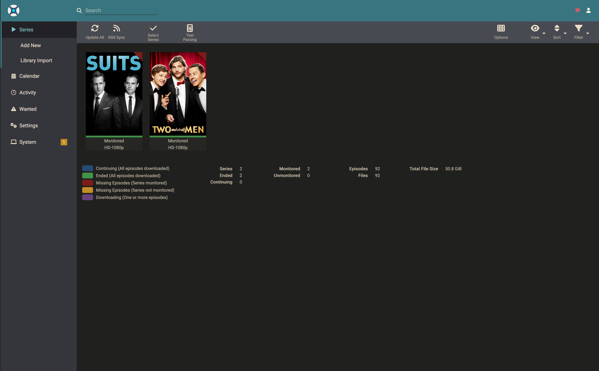

**Purpose:** TV series collection management  
**Details:** [Media Stack Setup](../media/)

#### Lidarr
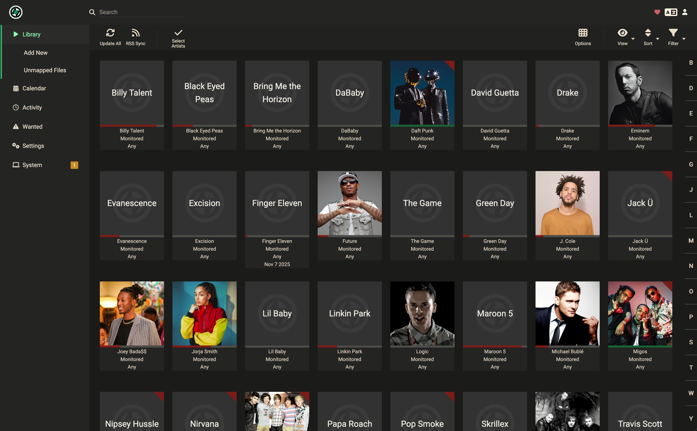

**Purpose:** Music collection management  
**Details:** [Media Stack Setup](../media/)

#### Bazarr
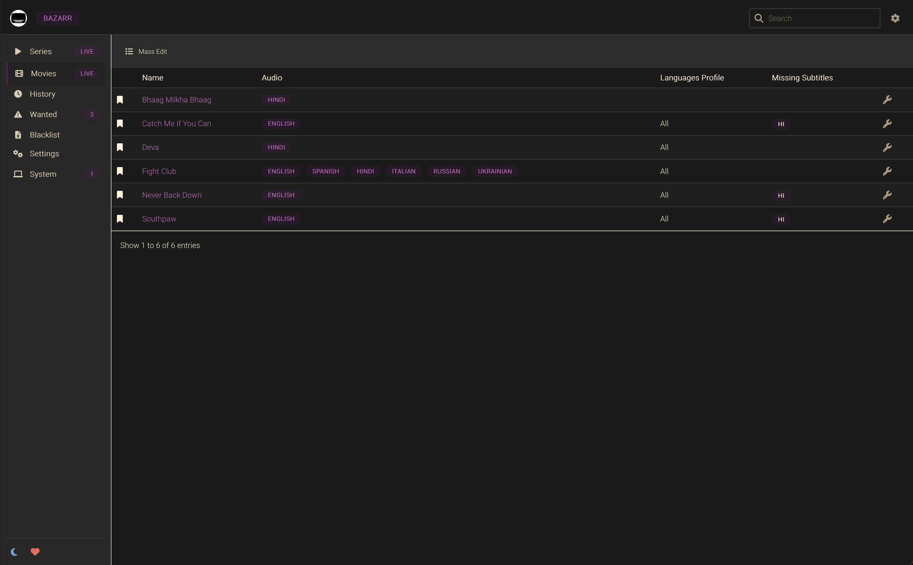

**Purpose:** Subtitle management for movies and TV shows  
**Details:** [Media Stack Setup](../media/)

#### qBittorrent
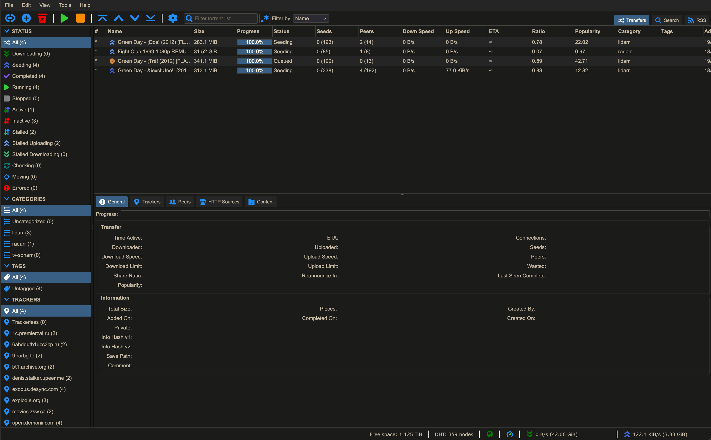

**Purpose:** BitTorrent client for downloading content  
**Details:** [Media Stack Setup](../media/)

#### Navidrome
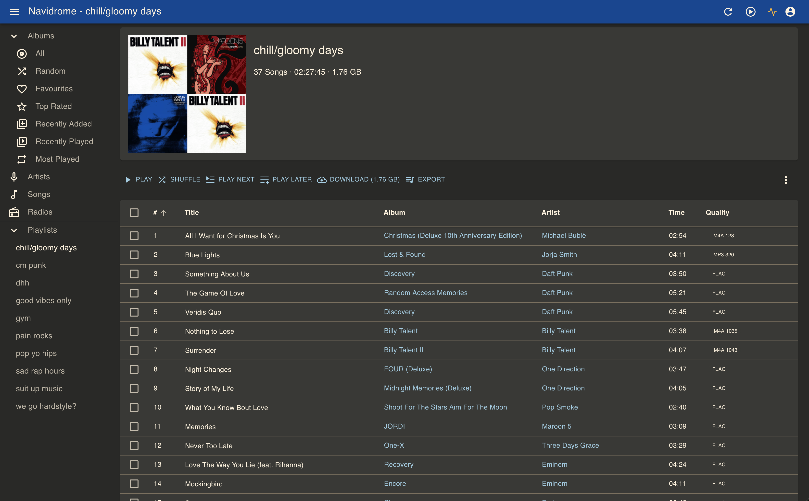

**Purpose:** Music streaming server and web player  
**Details:** [Media Stack Setup](../media/)

#### SoulSeek (slskd)
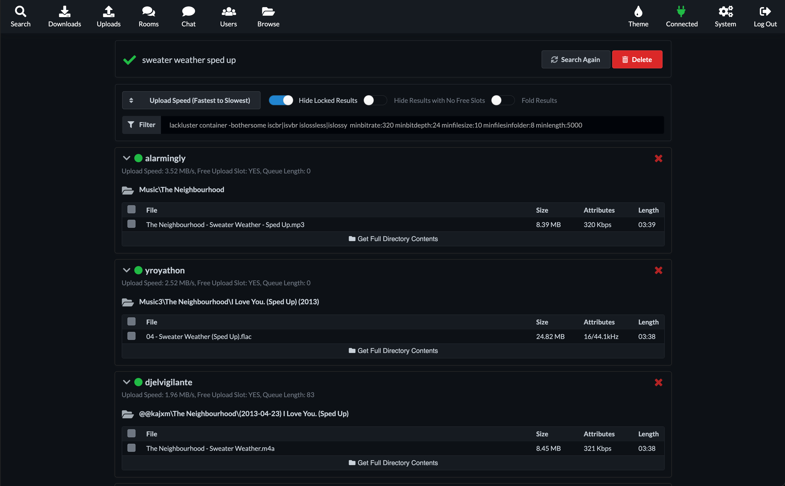

**Purpose:** Peer-to-peer music sharing network client  
**Details:** [Media Stack Setup](../media/)

#### JellyStat
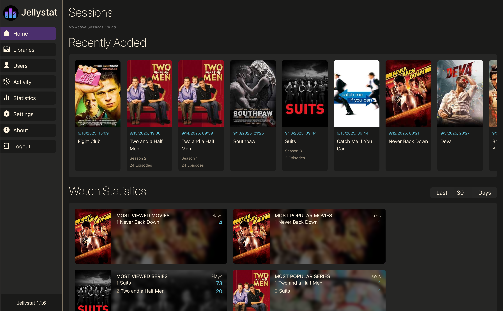

**Purpose:** Jellyfin statistics and analytics  
**Details:** [Media Stack Setup](../media/)

---

### Networking & Security

#### Pi-hole
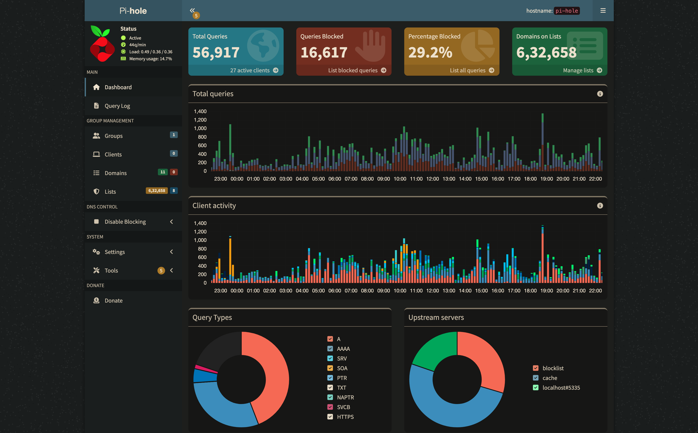

**Purpose:** Network-wide ad blocking and DNS management  
**Details:** [Networking Setup](../networking/)

#### Speedtest
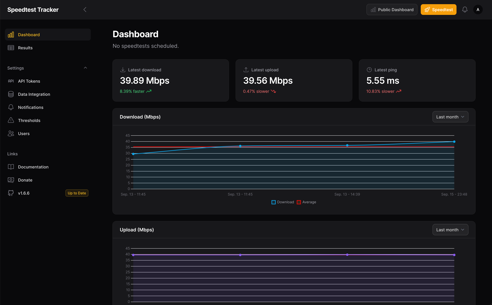

**Purpose:** Network speed monitoring and testing  
**Details:** [Networking Setup](../networking/)

---

### Monitoring & Analytics

#### Beszel

**Purpose:** Lightweight system monitoring and observability  
**Details:** [Monitoring Setup](../monitoring/)

---

## Getting Started

1. **Start with Infrastructure:** Set up [Proxmox](../proxmox/) as your virtualization platform
2. **Configure Networking:** Set up [Pi-hole and NGINX Proxy Manager](../networking/)
3. **Deploy Services:** Choose services based on your needs:
   - **Essential:** Homepage dashboard, Samba file sharing
   - **Media:** Complete media stack with *arr applications
   - **Cloud:** Nextcloud for files, Immich for photos
   - **Monitoring:** Beszel for system insights

## Service Distribution

- **LXC Containers:** Lightweight services (Pi-hole, Homepage, Samba, Tailscale, Beszel)
- **Virtual Machines:** Resource-intensive applications (Media stack, Cloud services)
- **Docker Compose:** Easy deployment and management of multi-container applications

Each service directory contains:
- Complete Docker Compose configurations
- Environment variable templates
- Setup instructions and screenshots
- Integration guides with other services