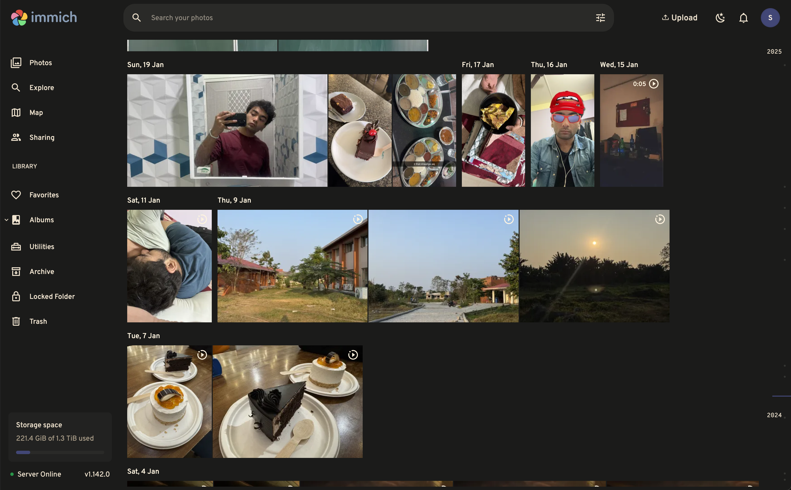

# Self-Host the Cloud

Ditching services like Google Workspace, Dropbox, iCloud, Microsoft 365, Amazon Photos, and other cloud service providers is critical for privacy and control. This guide shows how to deploy Nextcloud and Immich as your own cloud storage and photo/video backup solutions.

<p align="center">
 
 
</p>

<p align="center">
 <em>Immich (left) and Nextcloud (right) web dashboards – fully self-hosted cloud solutions.</em>
</p>

---

## Services Included

This deployment includes both **Immich** (photo & video backup) and **Nextcloud** (cloud storage) in a single Docker Compose stack.

- **Immich:** Self-hosted alternative to Google Photos with automatic mobile uploads, albums, and sharing
- **Nextcloud:** Self-hosted alternative to Dropbox, Google Drive, and iCloud
- **Compose file:** [`docker-compose.yml`](./docker-compose.yml)
- **Environment:** Uses a single `.env` file for all services (see [.env.example](./.env.example))

## Quick Start

1. Copy `docker-compose.yml` and `.env.example` to your deployment directory
2. Rename `.env.example` to `.env` and configure your settings:
   - Set storage paths (e.g., Samba share mounts)
   - Configure database passwords
   - Adjust user IDs and timezone
3. Run: `docker compose up -d`

### Access URLs

- **Immich:** http://your-server:2283
- **Nextcloud:** https://your-server:4443

---

## Nextcloud Advanced Topics

### NGINX Proxy Manager

Under details set the scheme to http, your local IP for the server, and the port 11000 then enable Block Common Exploits and Websocket Support under details. Under SSL enable Force SSL and HTTP/2 support. Under advanced add the following lines.

```sh
client_body_buffer_size 512k;
proxy_read_timeout 86400s;
client_max_body_size 0;
```

### Use a Network Share for Data Directory

```sh
sudo nano /etc/fstab
//YOUR_SAMBA_IP/nextcloud /nextcloud cifs rw,mfsymlinks,seal,username=user,password=password,uid=33,gid=0,file_mode=0770,dir_mode=0770 0 0
```

[Official Guide Doc](https://github.com/nextcloud/all-in-one?tab=readme-ov-file#can-i-use-a-cifssmb-share-as-nextclouds-datadir)

## Immich Advanced Topics

### Mobile App & Auto Upload

- Immich offers official mobile apps for Android and iOS, supporting automatic photo/video uploads directly to your server.
- See the [Immich mobile app documentation](https://immich.app/docs/mobile/) for setup and troubleshooting.

### Backup & Restore

- Back up your Immich database and upload storage regularly.
- Example backup command (Postgres):
	```sh
	docker exec immich_postgres pg_dump -U $DB_USERNAME $DB_DATABASE_NAME > immich_backup.sql
	```
- To restore, use `psql` or the Immich web UI import tools.

### Useful Links

- [Immich Documentation](https://immich.app/docs/)
- [GitHub Repo](https://github.com/immich-app/immich)

---
