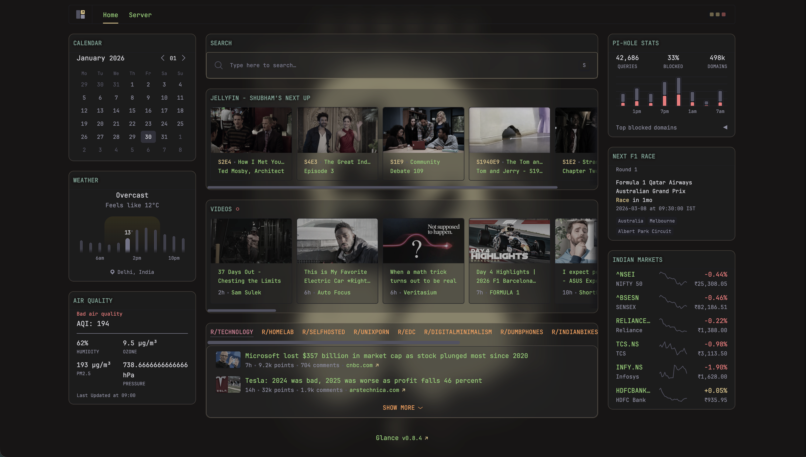
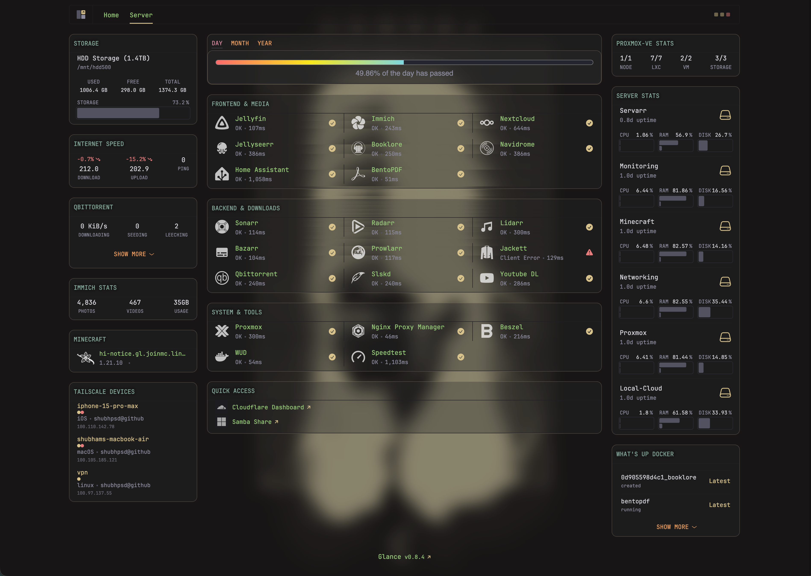

# Glance Dashboard

Switched from Homepage to [Glance](https://github.com/glanceapp/glance) and it's been a solid upgrade. Fast, clean, and way more customizable with the custom-api widgets.


_Home page with media widgets, RSS feeds, and monitoring_


_Server page with system stats and storage monitoring_

## Why Glance?

- **Performance** - Loads instantly with minimal overhead
- **Customization** - Custom-api widgets let you build pretty much anything
- **Clean UI** - Looks good out of the box, no wrestling with CSS
- **Theme switching** - Light/dark mode works properly with icon handling

## Current Setup

### Home Page

- **Weather & Calendar** - Local weather with hourly forecast and calendar widget
- **Air Quality Index** - Real-time AQI data with pollutant breakdown (PM2.5, ozone, humidity, pressure)
- **Search bar** - DuckDuckGo with custom bangs for YouTube, Reddit, GitHub
- **Jellyfin Next Up** - Continue watching carousel with thumbnails and progress bars
- **YouTube feed** - Latest videos from subscribed channels
- **RSS feeds** - Reddit (technology, homelab, selfhosted, unixporn, etc.), Hacker News, Lobsters
- **Pi-hole DNS stats** - Query stats, top domains, blocking percentage
- **F1 Next Race** - Upcoming Formula 1 race details with countdown
- **Indian Markets** - NIFTY 50, SENSEX, and major stock prices

### Server Page

- **Storage monitor** - Custom Python API showing all mounted drives with usage bars
- **Internet speed** - Live speedtest stats with percentage changes from average
- **qBittorrent stats** - Download speeds, active torrents, seeding/leeching counts with progress bars
- **Immich stats** - Photo/video count and total storage usage
- **Minecraft server** - Server status, player count, and MOTD
- **Tailscale devices** - All devices on tailnet with online status
- **Time progress bars** - Day/month/year progress tracking (kinda cool, kinda depressing)
- **Service monitors**:
  - Frontend: Jellyfin, Immich, Nextcloud, Jellyseerr, Navidrome, Home Assistant, BentoPDF
  - Backend: Sonarr, Radarr, Lidarr, Bazarr, Prowlarr, Jackett, qBittorrent, Slskd, Youtube DL
  - System: Proxmox, Nginx Proxy Manager, Beszel, WUD, Speedtest
- **Proxmox stats** - VM/LXC counts and status across cluster nodes
- **Beszel monitoring** - CPU, RAM, disk, temps for all servers in the homelab
- **WUD (What's Up Docker)** - Container update notifications

## Installation

1. **Deploy Glance container:**

   ```bash
   docker run -d \
     --name glance \
     -p 8080:8080 \
     -v /docker/glance/config:/app/config \
     -v /docker/glance/assets:/app/assets \
     glanceapp/glance
   ```

   Or use the provided `compose.yml`:

   ```bash
   cd homepage/
   docker compose up -d
   ```

2. **Configure your widgets:**

   Copy the configuration files:

   ```bash
   cp glance.yml /docker/glance/config/
   cp home.yml /docker/glance/config/
   cp server.yml /docker/glance/config/
   cp disk-monitor.py /docker/glance/
   ```

3. **Set up environment variables:**

   Create `/docker/glance/config/.env` using `.env.example` as a template:

   ```bash
   cp .env.example /docker/glance/config/.env
   # Edit the .env file with your actual API keys and credentials
   nano /docker/glance/config/.env
   ```

4. **Deploy the disk monitor:**

   The disk monitor is a simple Python API that reads disk usage and returns styled HTML:

   ```bash
   docker run -d \
     --name glance-disk-monitor \
     -p 8888:8888 \
     -v /:/host:ro \
     -v /docker/glance-disk-monitor:/app \
     python:3.11-slim \
     sh -c "pip install flask && python /app/disk-monitor.py"
   ```

   Or it's already included in the `compose.yml`.

5. **Restart and verify:**

   ```bash
   docker restart glance
   # Check logs
   docker logs -f glance
   ```

   Access the dashboard at `http://your-server-ip:8080`

## Custom Storage Monitor

Custom Python API that reads disk usage from the host filesystem and returns styled HTML. Shows all mounted drives with proper progress bars and color-coded status (green < 60%, yellow < 80%, red >= 80%).

Located in `disk-monitor.py` - modify the `paths` array to add/remove drives you want to monitor.

## Features

### Icon Theme Switching

Icons use the `auto-invert` prefix with dark versions from the selfhst CDN:

```yaml
icon: auto-invert https://cdn.jsdelivr.net/gh/selfhst/icons@main/png/beszel-dark.png
```

This makes them automatically invert to white when switching to dark theme. No more invisible black icons on dark backgrounds.

## Configuration Structure

```bash
homepage/
├── compose.yml             # Docker Compose configuration
├── glance.yml              # Main Glance config (includes home.yml & server.yml)
├── home.yml                # Home page widgets configuration
├── server.yml              # Server page widgets configuration
├── disk-monitor.py         # Python script for storage monitoring
├── .env.example            # Environment variables template
├── home-page.png           # Screenshot of home page
├── server-page.png         # Screenshot of server page
└── old/                    # Archived Homepage configs
    ├── compose.yaml
    ├── docker.env.example
    ├── homepage-dashboard.png
    └── config/
```

## API Keys & Authentication

All sensitive credentials are stored in the `.env` file. You'll need API keys from:

- **Jellyfin** - Settings > API Keys
- **Immich** - Account Settings > API Keys
- **Tailscale** - [Settings > Keys](https://login.tailscale.com/admin/settings/keys) (expires every 90 days)
- **Proxmox** - Datacenter > Permissions > API Tokens
- **Beszel** - Generate admin API token
- **Speedtest Tracker** - Settings > API
- **\*arr apps** - Settings > General > API Key
- **Pi-hole** - Settings > API (v6 uses password instead of token)
- **WAQI (Air Quality)** - [Get free token](https://aqicn.org/data-platform/token/)

## Troubleshooting

**Widgets not loading?**

- Check Docker logs: `docker logs glance`
- Verify `.env` file has correct API keys
- Make sure DNS settings point to Pi-hole (192.168.1.102)

**Icons not showing?**

- Verify CDN URLs are accessible
- Check if you're using `auto-invert` prefix for dark theme icons

**Disk monitor not working?**

- Check disk-monitor container logs: `docker logs glance-disk-monitor`
- Verify volume mounts match your actual storage paths

---

**Previous setup:** Old Homepage dashboard configs are archived in the `old/` directory for reference.
