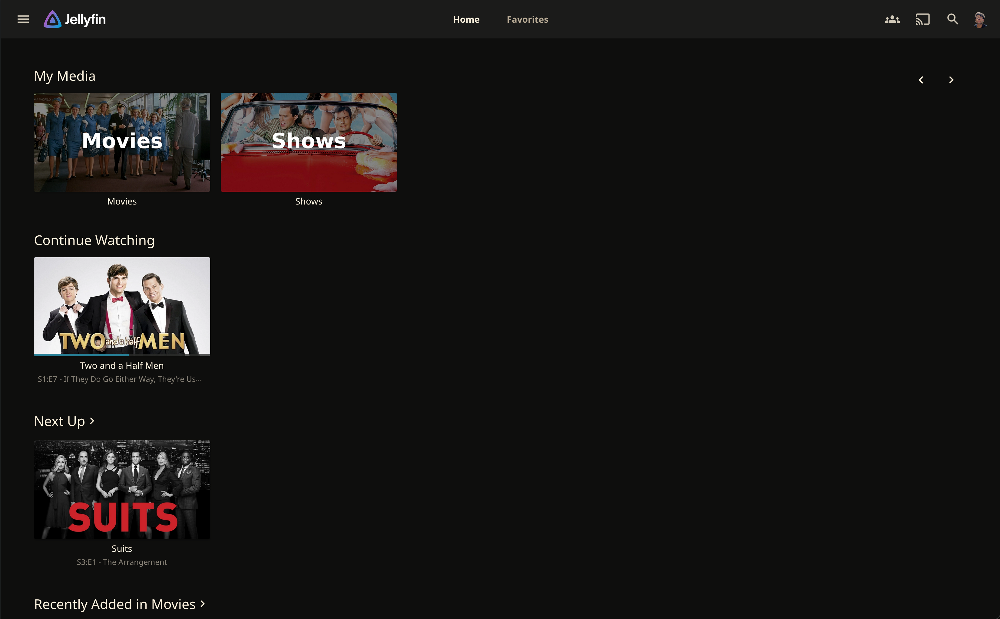
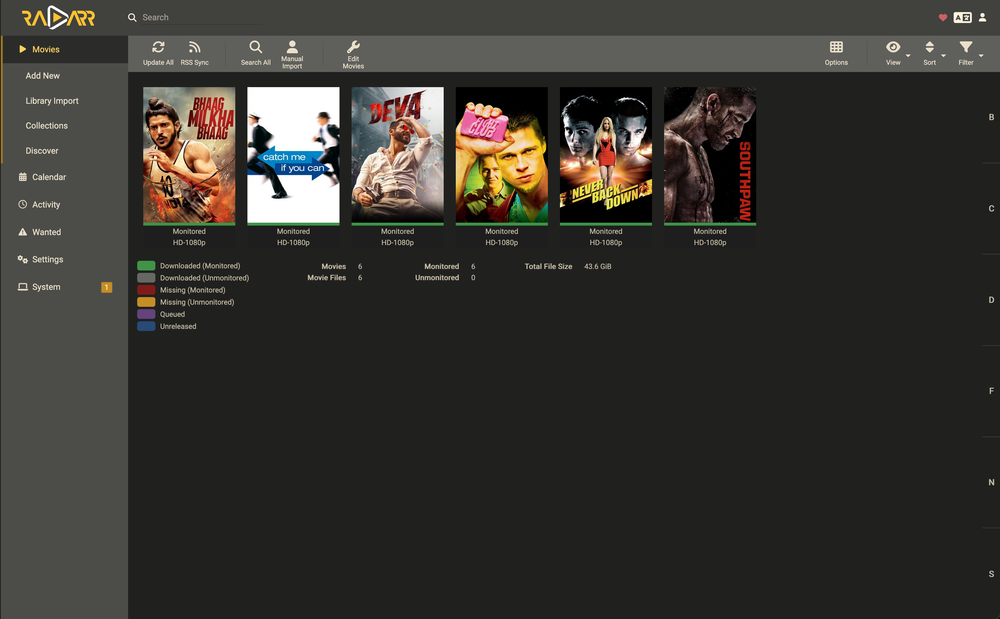
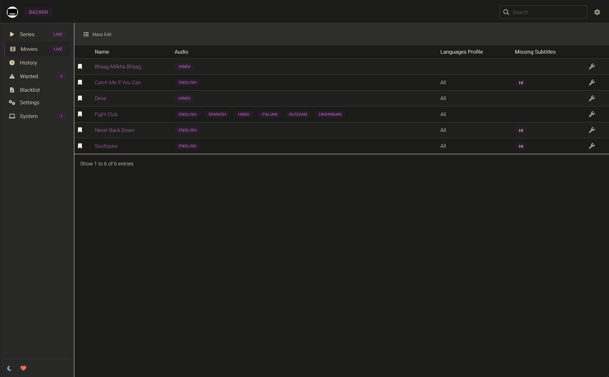

# Media Server Stack

This directory contains a unified Docker Compose setup for a complete media stack, including Jellyfin, Music app, the *arr suite, download clients, and more. All services are configured to run on a dedicated Docker network and use a single `.env` file for easy configuration.

## Service Screenshots

<p align="center">
  
  
  
</p>

<p align="center">
  
  
  
</p>

<p align="center">
  
  
  
</p>

<p align="center">
  
  
</p>

<p align="center">
  <em>Complete media stack: Jellyfin, Jellyseerr, Jellystat, *arr suite, download clients, and music streaming (Navidrome server with Amperfy client for iOS/macOS).</em>
</p>

## Services Included

| Service | Purpose | Default Port |
|---|---|---|
| **Jellyfin** | Media Streaming Server | `8096` |
| **Navidrome** | Music Streaming Server (works with Amperfy on iOS/macOS) | `4533` |
| **Jellyseerr** | Media Request Manager | `5055` |
| **Jellystat** | Jellyfin Statistics | `3000` |
| **Bazarr** | Subtitle Management | `6767` |
| **qBittorrent** | Torrent Download Client | `8080` |
| **SLSKD** | Soulseek P2P Client | `5030` |
| **Prowlarr** | Indexer Manager | `9696` |
| **Sonarr** | TV Show Automation | `8989` |
| **Radarr** | Movie Automation | `7878` |
| **Lidarr** | Music Automation | `8686` |
| **Jackett** | Indexer Proxy | `9117` |
| **FlareSolverr** | Cloudflare Bypass | `8191` |

## Quick Start

1. **Prepare Environment:**
    - Copy `.env.example` to `.env`.
    - Edit `.env` with your `PUID`, `PGID`, `TZ`, and other settings.
    - Ensure your media data is mounted at `/data` inside the VM, as configured in the Samba documentation.

2. **Deploy the Stack:**

    ```bash
    docker compose up -d
    ```

3. **Access Services:**
    - Access each service via `http://<your-vm-ip>:<port>`.

## Directory Structure

This setup assumes the following directory structure on your host. All configuration will be stored locally in the `media` directory.

```
media/
├── docker-compose.yml
├── .env.example
├── jellyfin/
│   └── config/
├── navidrome/
│   └── config/
├── jellyseerr/
│   └── config/
├── jellystat/
│   ├── postgres/
│   └── backup/
├── bazarr/
│   └── config/
├── qbittorrent/
│   └── config/
├── slskd/
│   └── config/
├── prowlarr/
│   └── config/
├── sonarr/
│   └── config/
├── radarr/
│   └── config/
├── lidarr/
│   └── config/
└── jackett/
    └── config/
```

## GPU Transcoding Setup

<p align="center">

</p>
<p align="center">
  <em>Intel QuickSync hardware transcoding in action - significantly reducing CPU usage during video playback.</em>
</p>

### Proxmox PCI Passthrough Configuration

To enable Intel QuickSync hardware transcoding in Jellyfin, you need to pass through the integrated GPU to your Servarr VM.

#### 1. Enable IOMMU in Proxmox

Edit `/etc/default/grub`:

```bash
GRUB_CMDLINE_LINUX_DEFAULT="quiet intel_iommu=on iommu=pt"
```

Update GRUB and reboot:

```bash
update-grub
reboot
```

#### 2. Add GPU to VM Configuration

In Proxmox web interface:

1. Go to your Servarr VM → Hardware
2. Click "Add" → "PCI Device"
3. Select the Intel GPU device (usually `0000:00:02.0`)
4. Enable "All Functions" and "Primary GPU" if needed
5. Start the VM

Alternatively, edit `/etc/pve/qemu-server/101.conf` directly:

```ini
hostpci0: 0000:00:02.0
```

#### 3. Install Intel GPU Drivers in VM

Inside the Servarr VM:

```bash
# Update system
sudo apt update && sudo apt upgrade -y

# Install Intel GPU drivers
sudo apt install intel-media-va-driver-non-free intel-gpu-tools

# Verify GPU is accessible
ls -la /dev/dri/
intel_gpu_top
```

#### 4. Configure Jellyfin for Hardware Transcoding

1. Access Jellyfin web interface
2. Go to Dashboard → Playback → Transcoding
3. Set Hardware acceleration to "Video Acceleration API (VAAPI)"
4. Set VA API Device to `/dev/dri/renderD128`
5. Enable hardware decoding for your preferred codecs

The GPU transcoding setup significantly reduces CPU usage during video playback and allows for multiple simultaneous streams.

---

## Samba Integration

The `/data` volume in this `docker-compose.yml` points to the Samba share you configured previously. This allows all media services to access your central storage pool for both reading (libraries) and writing (downloads).

- **qBittorrent** saves completed downloads to `/data/downloads`.
- ***arr stack** moves and organizes files from `/data/downloads` to `/data/media/movies`, `/data/media/tv`, etc.
- **Jellyfin & Navidrome** read from the organized media directories to serve content.

This creates a seamless, automated media pipeline from download to playback.
