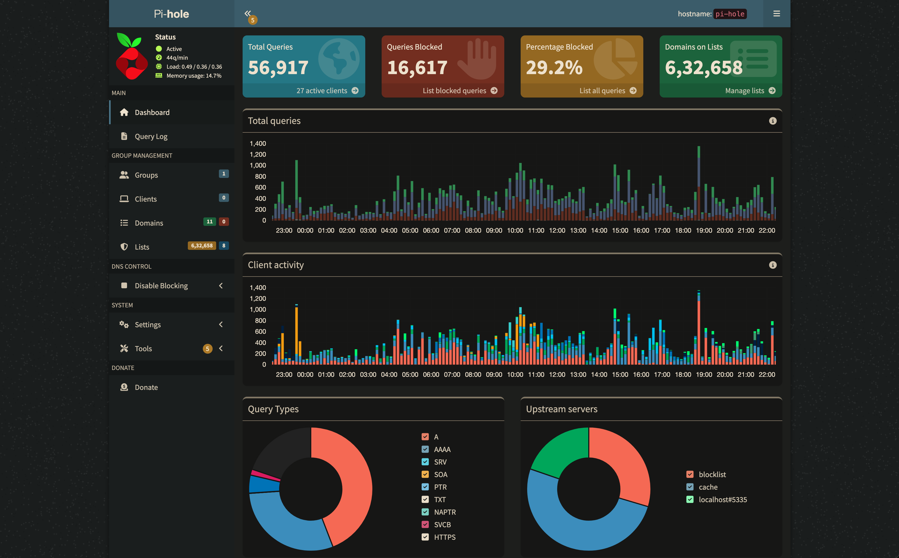

# Networking Services

This directory contains the networking infrastructure for the homelab, including DNS ad-blocking, reverse proxy, secure tunnels, VPN access, and network monitoring. The setup provides both internal network optimization and secure external access to services.


*Pi-hole dashboard showing DNS query blocking and network-wide ad protection.*


*Speedtest Tracker monitoring network performance over time.*

## Services Overview

| Service | Container/LXC | Purpose | Access Port |
|---------|---------------|---------|-------------|
| **Pi-hole** | LXC 102 | DNS Ad-blocking & Network-wide filtering | `80` (web admin) |
| **Tailscale** | LXC 104 | Mesh VPN for secure remote access | N/A |
| **Nginx Proxy Manager** | LXC 105 | Reverse proxy with web GUI | `8181` (admin) |
| **Cloudflare Tunnel** | LXC 105 | Secure external access without port forwarding | N/A |
| **Speedtest Tracker** | LXC 105 | Network performance monitoring | `8080` |

## Quick Setup

### 1. Pi-hole (LXC 102)

Pi-hole provides network-wide ad blocking by acting as a DNS sinkhole. Install using the Proxmox community script:

```bash
# Run on Proxmox host to create Pi-hole LXC
bash -c "$(curl -fsSL https://raw.githubusercontent.com/community-scripts/ProxmoxVE/main/ct/pihole.sh)"
```

**Post-installation configuration:**
1. Access Pi-hole admin at `http://YOUR_PIHOLE_IP/admin`
2. Configure your router or devices to use Pi-hole as DNS server
3. Add recommended blocklists (see below)

### 2. Tailscale VPN (LXC 104)

Tailscale creates a secure mesh VPN for remote access to your homelab. Add to any existing LXC:

```bash
# Run inside target LXC container
bash -c "$(curl -fsSL https://raw.githubusercontent.com/community-scripts/ProxmoxVE/main/tools/addon/add-tailscale-lxc.sh)"
```

**Setup steps:**
1. Create account at [tailscale.com](https://tailscale.com)
2. Run `tailscale up` in the container
3. Authenticate with your Tailscale account
4. Configure subnet routing if needed for LAN access

### 3. Networking Stack (LXC 105)

The networking container runs Nginx Proxy Manager, Cloudflare Tunnel, and Speedtest Tracker:

```bash
# Inside LXC 105
cp docker-compose.yml .env.example /path/to/networking/
cd /path/to/networking/
cp .env.example .env
# Edit .env with your values
docker compose up -d
```

## Detailed Configuration

### Pi-hole Blocklists

Recommended blocklists for comprehensive ad and tracker blocking:

```
# Core ad blocking
https://raw.githubusercontent.com/StevenBlack/hosts/master/hosts

# Pro-level blocking (Hagezi)
https://raw.githubusercontent.com/hagezi/dns-blocklists/main/adblock/pro.txt

# AdGuard DNS filter
https://adguardteam.github.io/AdGuardSDNSFilter/Filters/filter.txt

# EasyList
https://v.firebog.net/hosts/Easylist.txt

# Mobile tracking
https://adaway.org/hosts.txt
https://perflyst.github.io/PiHoleBlocklist/android-tracking.txt

# Smart TV tracking
https://perflyst.github.io/PiHoleBlocklist/AmazonFireTV.txt

# Regional blocking
https://adguardteam.github.io/HostlistsRegistry/assets/filter_27.txt
```

**To add blocklists:**
1. Go to Pi-hole Admin → Group Management → Adlists
2. Add each URL above
3. Go to Tools → Update Gravity
4. Wait for lists to update

### Nginx Proxy Manager Setup

1. **Access admin interface:** `http://YOUR_LXC_IP:8181`
2. **Default credentials:** 
   - Email: `admin@example.com`
   - Password: `changeme`
3. **Add proxy hosts** for each service you want to expose:
   - Domain: `service.yourdomain.com`
   - Forward to: `internal_service_ip:port`
   - Enable SSL with Let's Encrypt

### Cloudflare Tunnel Configuration

1. **Create tunnel** in Cloudflare dashboard
2. **Copy tunnel token** to `.env` file
3. **Configure routes** in Cloudflare:
   - `jellyfin.yourdomain.com` → `http://nginx-proxy-manager:80`
   - `nextcloud.yourdomain.com` → `http://nginx-proxy-manager:80`
   - Add routes for each public service

### Network Architecture

```
Internet
    ↓
Cloudflare Tunnel (secure)
    ↓
Nginx Proxy Manager (reverse proxy)
    ↓
Internal Services (Jellyfin, Nextcloud, etc.)
    ↓
Pi-hole (DNS filtering)
    ↓
Local Network Devices
    ↑
Tailscale (VPN access)
```

## Security Features

- **DNS filtering:** Pi-hole blocks malicious domains and ads network-wide
- **Zero-trust tunnel:** Cloudflare tunnels eliminate need for port forwarding
- **SSL termination:** Nginx Proxy Manager handles certificates automatically
- **Mesh VPN:** Tailscale provides secure remote access without exposing services
- **Network monitoring:** Speedtest Tracker monitors connection performance

## Troubleshooting

### Pi-hole Issues
```bash
# Check Pi-hole status
pihole status

# Update gravity (blocklists)
pihole -g

# Restart Pi-hole service
sudo service pihole-FTL restart
```

### Tailscale Issues
```bash
# Check connection status
tailscale status

# Re-authenticate
tailscale up

# Check logs
journalctl -u tailscaled
```

### Docker Issues
```bash
# Check container status
docker compose ps

# View logs
docker compose logs [service_name]

# Restart services
docker compose restart
```

## Performance Monitoring

- **Pi-hole:** Query logs show blocked vs allowed requests
- **Speedtest Tracker:** Automated speed tests track ISP performance
- **Nginx logs:** Access and error logs in NPM interface
- **Tailscale:** Connection quality in admin console

This networking setup provides enterprise-grade security and accessibility for your homelab while maintaining ease of management through web interfaces.